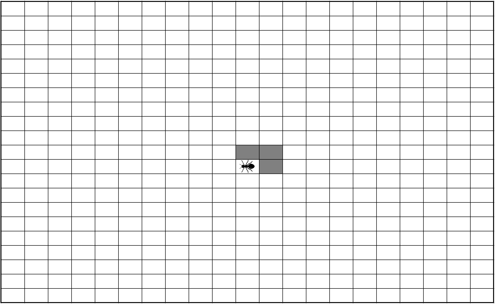
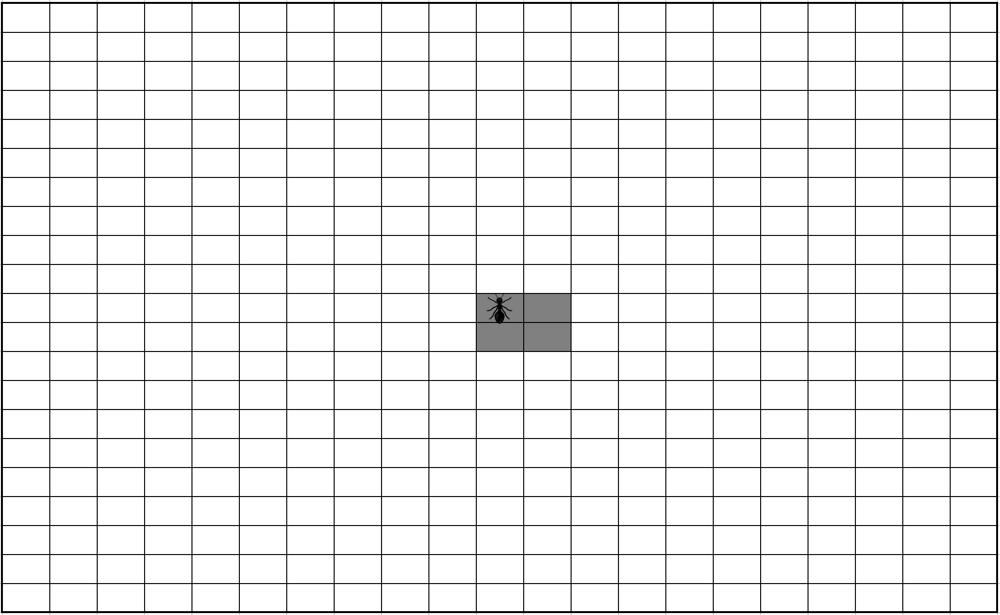
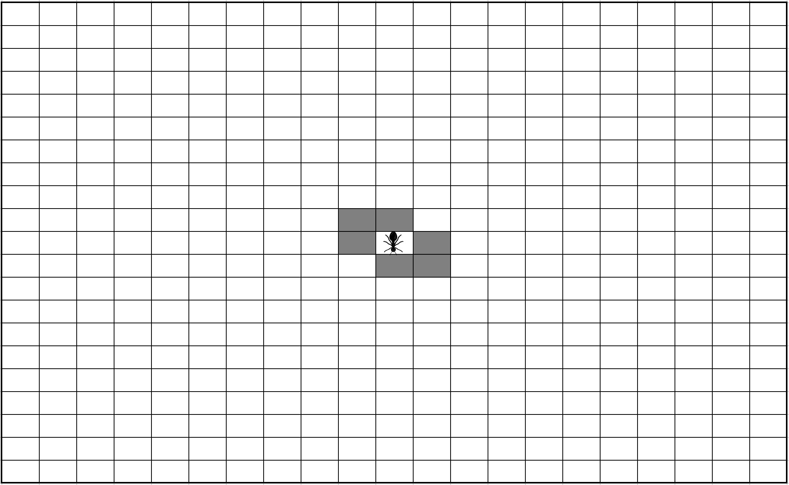

# First rules and Component State

## Some things before start
Today, we know how create a stateless component : a simple function.
``` jsx
const MyComponent = () => (
  <span>My component works !</span>
);
```
 And how create a stateless component with props (optionals or not) :
``` jsx
interface ComponentProps {
  componentName?: string
};
const MyComponent = ({componentName = 'New Component'}: ComponentProps) => (
  <span>{{componentName}} works !</span>
);
```
Before the next step in our application, we have to learn 2 functionalities in React: 
* class components 
* component state management.

### From a function to a class
Take our example of component without props :
``` jsx
const MyComponent = () => (
  <span>My component works !</span>
);
```
You can convert it to class in five steps :
1. Create an TypeScript class, with the same name, that extends React.Component.
1. Add a single empty method to it called render().
1. Move the body of the function into the render() method.
1. Replace props with this.props in the render() body.
1. Delete the remaining empty function declaration.
``` jsx
class MyComponent extends React.Component {
  render() {
    return (
      <span>My component works !</span>
    );
  }
}
```
Now, add props
``` jsx
interface ComponentProps {
  componentName?: string
};
class MyComponent extends React.Component<ComponentProps> {
  render() {
    let { componentName } = this.props; //disintegration
    if (!componentName) { 
      componentName = 'New Component'; //define default value
    }
    return (
      <span>{{componentName}} works !</span>
    );
  }
}
```
The class slightly complicates things : we have to define manually the default values and more lines of code are needed.
But this is useful to implement a new react functionality : __component state__ .

### Adding a local state to a class
1. Define a State interface and add a line with `state` to show a date
``` jsx
interface ComponentProps {
  componentName?: string;
}
interface ComponentState {
  author: string;
}
class MyComponent extends React.Component<ComponentProps, ComponentState> {
  render() {
    let { componentName } = this.props; //disintegration
    if (!componentName) { 
      componentName = 'New Component'; //define default value
    }
    return (
      <span>
        {{componentName}} works !
        <br />
        Thanks {this.state.author}.
      </span>
    );
  }
}
```
2. Add a class constructor that assigns the initial this.state:
``` jsx
interface ComponentProps {
  componentName?: string;
}
interface ComponentState {
  author: string;
}
class MyComponent extends React.Component<ComponentProps, ComponentState> {
  constructor(props: ComponentProps) {
    super(props);
    this.state = {author: 'Benoit'} as ComponentState;
  }
  render() {
    let { componentName } = this.props; //disintegration
    if (!componentName) { 
      componentName = 'New Component'; //define default value
    }
    return (
      <span>
        {{componentName}} works !
        <br />
        Thanks {this.state.author}.
      </span>
    );
  }
}
```
Note how we pass `props` to the base constructor:
``` typescript
constructor(props: ComponentProps) {
  super(props);
  this.state = {author: 'Benoit'} as ComponentState;
}
```
Class components should always call the base constructor with props.

### Update component local state
Now, we add and input to update author value :
``` jsx
interface ComponentProps {
  componentName?: string;
}
interface ComponentState {
  author: string;
}
class MyComponent extends React.Component<ComponentProps, ComponentState> {
  constructor(props: ComponentProps) {
    super(props);
    this.state = { author: 'Benoit' } as ComponentState;
  }

  render() {
    let { componentName } = this.props;
    if (!componentName) {
      componentName = 'New Component';
    }
    return (
      <div>
        <p><input type="text" value={this.state.author} /></p>
        <p>
          <span>
            {{ componentName }} works !
          <br />
            Thanks {this.state.author}.
        </span>
        </p>
      </div>
    );
  }
}
```

If you test this and try to update value, that doesn't work. Why? The React one-way binding.

If you want update value, you have to implement the event `onChange`.
``` jsx
interface ComponentProps {
  componentName?: string;
}
interface ComponentState {
  author: string;
}
class MyComponent extends React.Component<ComponentProps, ComponentState> {
  constructor(props: ComponentProps) {
    super(props);
    this.state = { author: 'Benoit' } as ComponentState;
  }

  onChange = (e: React.ChangeEvent<HTMLInputElement>) => {
    this.setState({ author: (e.target as HTMLInputElement).value });
  }

  render() {
    let { componentName } = this.props;
    if (!componentName) {
      componentName = 'New Component';
    }
    return (
      <div>
        <p><input type="text" value={this.state.author} onChange={this.onChange} /></p>
        <p>
          <span>
            {{ componentName }} works !
          <br />
            Thanks {this.state.author}.
        </span>
        </p>
      </div>
    );
  }
}
```
You can try and enjoy !

Now you're armed to start the next step.

## Rules, expected behavior
Remember : our Langton's Ant moves according this 2 rules :
* At a white square, turn 90° right, flip the color of the square, move forward one unit
* At a black square, turn 90° left, flip the color of the square, move forward one unit

Please implement this rules on play button's click.

To illustrate, I have made an example mapping for 10 steps (You can use it to make your unit tests) :
<table>
  <tr><th>Step</th><th>Before</th><th>After</th></tr>
  <tr><th>1</th><td></td><td></td>
  <tr><th>2</th><td></td><td></td>
  <tr><th>3</th><td></td><td></td>
  <tr><th>4</th><td></td><td></td>
  <tr><th>5</th><td></td><td></td>
  <tr><th>6</th><td></td><td></td>
  <tr><th>7</th><td></td><td></td>
  <tr><th>8</th><td></td><td></td>
  <tr><th>9</th><td></td><td></td>
  <tr><th>10</th><td></td><td></td>
</table>

# Reminders

5 Steps to reproduce every cycle:
1. Add a new test
1. Run all tests and verify if the new test fails
1. Write code to pass the new test to green
1. Run all tests and verify all are green
1. Refactor

Before each test, we launch a five minutes timer.
* If the code compiles and the tests are green, commit!
* Otherwise, revert!

All __your__ code must be covered by unit tests.

We'll avoid maximum `any` (implicit or not).

## Exercice Solution
[_Download Example_](https://github.com/Bogala/langton-ant-dojo/archive/step3.zip)
