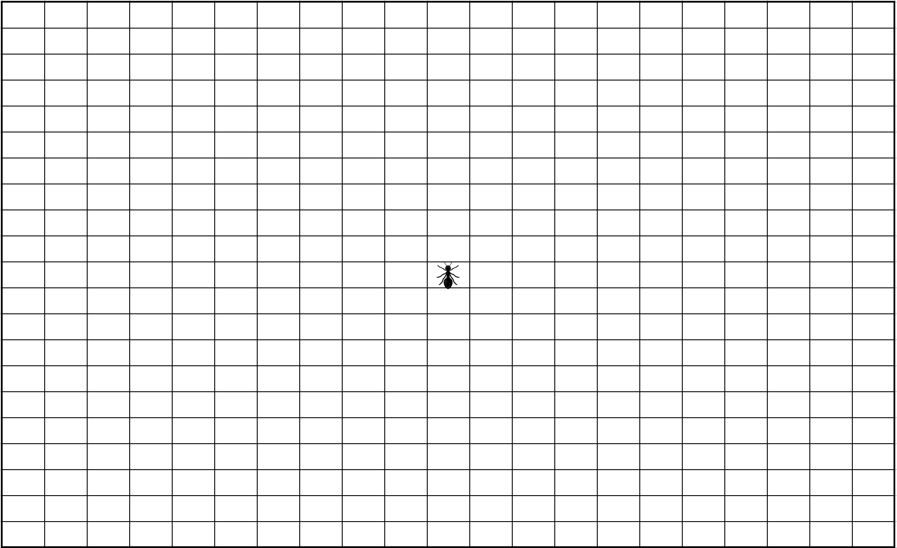
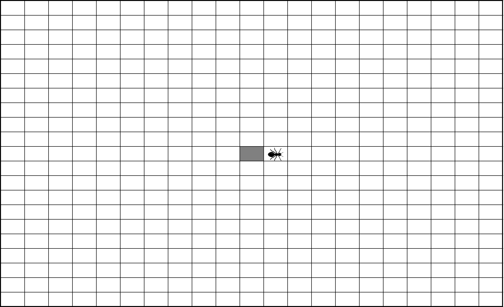
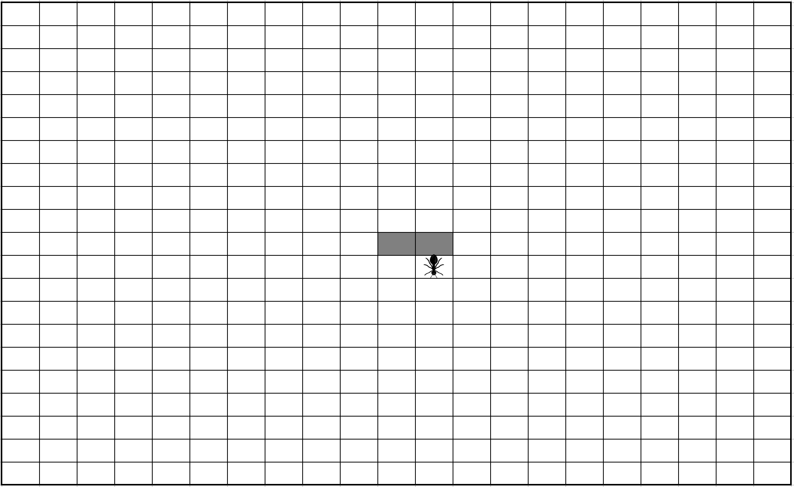
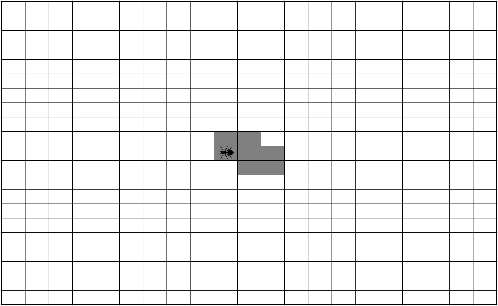

# First rules and Component State

Remember : our Langton's Ant moves according this 2 rules :
* At a white square, turn 90° right, flip the color of the square, move forward one unit
* At a black square, turn 90° left, flip the color of the square, move forward one unit

Please implement this rules on play button's click.

To illustrate, I have made an example mapping for 10 steps :
<table>
  <tr><th>Step</th><th>Before</th><th>After</th></tr>
  <tr><th>1</th><td></td><td></td></tr>
  <tr><th>2</th><td></td><td></td></tr>
  <tr><th>3</th><td></td><td></td></tr>
  <tr><th>4</th><td></td><td></td></tr>
  <tr><th>5</th><td></td><td></td></tr>
  <tr><th>6</th><td></td><td></td></tr>
  <tr><th>7</th><td></td><td></td></tr>
  <tr><th>8</th><td></td><td></td></tr>
  <tr><th>9</th><td></td><td></td></tr>
  <tr><th>10</th><td></td><td></td></tr>
</table>

# Reminders

5 Steps to reproduce every cycle:
1. Add a new test
1. Run all tests and verify if the new test fails
1. Write code to pass the new test to green
1. Run all tests and verify all are green
1. Refactor

Before each test, we launch a five minutes timer.
* If the code compiles and the tests are green, commit!
* Otherwise, revert!

All __your__ code must be covered by unit tests.

We'll avoid maximum `any` (implicit or not).

## Exercice Solution
[_Download Example_](https://github.com/Bogala/langton-ant-dojo/archive/step3.zip)
