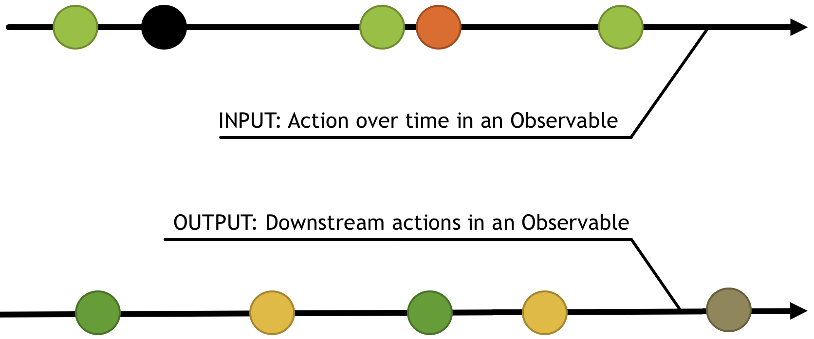

# Asynchronous logic with Redux
> Work in progress

Redux reducers handle state transitions, but they must be 
handled synchronously.

But what about Async like User interactions, ajax calls, web sockets or animations?
More with harder to manage as ajax cancellation, composed ajax, etc.

See more with my presentation [async-reduc-observable](https://github.com/Bogala/async-redux-observable)

## Observables and RxJS
What is an opbservable ?
* a set of events
* 0, 1 or more values
* over any amount of time
* cancellable and lazy

What is RxJS ? Observables and functions to create and compose Observables, also knwown as "Lodash for async".
RxJS combines the Observer pattern with the Iterator pattern and functional programming with collections to fill the need for an ideal way of managing sequences of events.


### Create Observables
* `of('hello')`
* `from ([1, 2, 3, 4])`
* `interval(1000)`
* `ajax('http://example.com')`
* `webSocket('ws://echo.websocket.com')`
* many more

### Subscribe an Observable
``` js
myObservable.subscribe(
  value => console.log('next', value),
  err => console.roor('error', err),
  () => console.info('complete!')
);
``` 


## Redux and Epics
An Epic is the core primitive of redux-observable.

It is a function that takes a stream of all actions dispatched 
and returns a stream of new actions to dispatch.



## Refactor
### Add RxJS and Redux-observable middleware

## New functional need
Please try over 900 movements... Your ant needs a bigger grid.
So, now, we nedd to have a dynamic size for our grid.


> When you're done, you can go to the [next step : Advanced Typescript](./STEP_6.md)

# Reminders

5 Steps to reproduce every cycle:
1. Add a new test
1. Run all tests and verify if the new test fails
1. Write code to pass the new test to green
1. Run all tests and verify all are green
1. Refactor

Before each test, launch a five minutes timer.
* If the code compiles and the tests are green, commit!
* Otherwise, revert!

All of __your__ code must be covered by unit tests.

We'll avoid `any` as much as possible (implicit or not).

## Exercice Solution
[_Download Example_](https://github.com/Bogala/langton-ant-dojo/archive/step5.zip)
